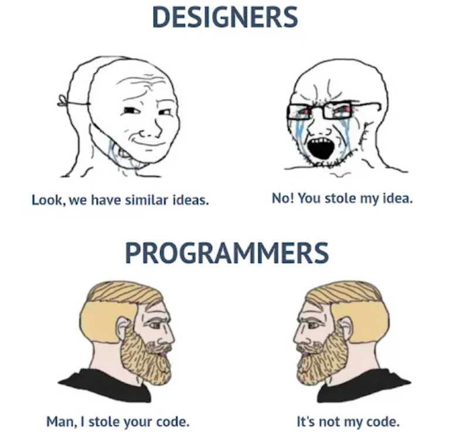

# markdown_test
stepik

# Test Markdown :)

Nowy paragraf_1 </br>some text text text ...

Nowy paragraf_2 </br>some text text text ...

Nowy paragraf_3 </br>some text text text ...

**Lorem Ipsum is simply dummy text of the printing and typesetting industry.**

*Lorem Ipsum has been the industry's standard dummy text ever since the 1500s...*

~~It has survived not only five centuries, but also the leap into electronic typesetting, remaining essentially unchanged.~~

Some quote:

>It is a long established fact that a reader will be distracted by the readable content of a page when looking at its layout.

List_1:

1. Jeden
2. Dwa
3. Trzy
4. Cztery
5. P...

List_2:

- jeden
+ dwa
* try
    - podlista

Some code:

Example `print('Hello GitHub!'`

```py
``print('How are you today?')`` it is the 2 example
```

Block:

```py
print('Hi')
def factorial(n):
    if n == 0:
        return 1
    else:
        return (n * factorial(n - 1))
print(factorial(3))
```



